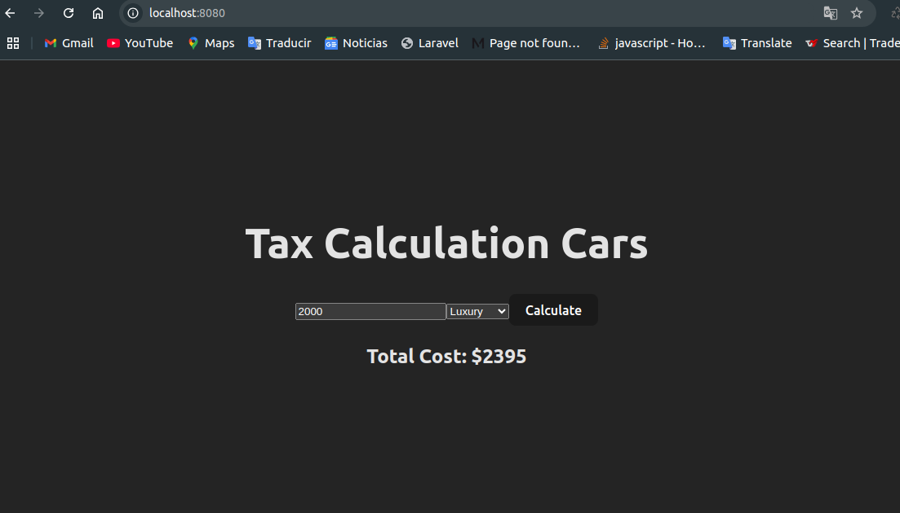

# Progi Code Challenge :rocket:

## The Tax Calculation Tool

### `Up Docker Containers back, front:`
```bash
# (back, front)
$ docker-compose up --build
```

### `Local Apps:`
| Resource            | Url                                                                                        |
|---------------------|--------------------------------------------------------------------------------------------|
| back     | [http://localhost:8081](http://localhost:8081)                                             |
| front  | [http://localhost:8080](http://localhost:8080)                             |


## Print Screen



## Luis Villanueva

- Email: [luiscavillanuevapaz@gmail.com](mail://luiscavillanuevapaz@gmail.com)

- Github: [@luisvillapaz23](https://github.com/luisvillapaz23)

- Linkedin - [Luis Villanueva](https://www.linkedin.com/in/luis-villanueva-728708216/)